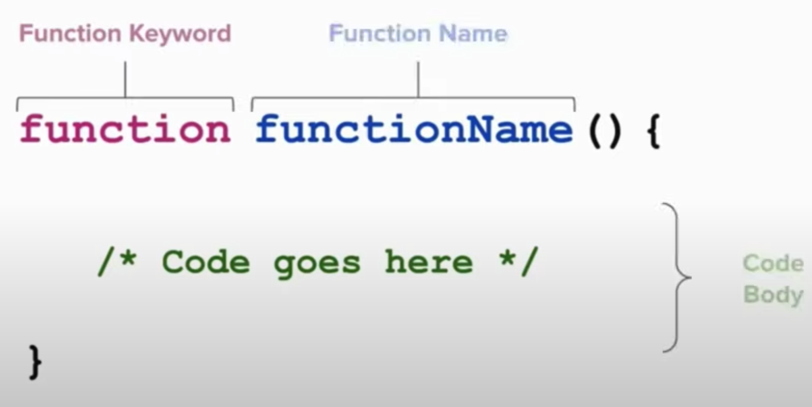
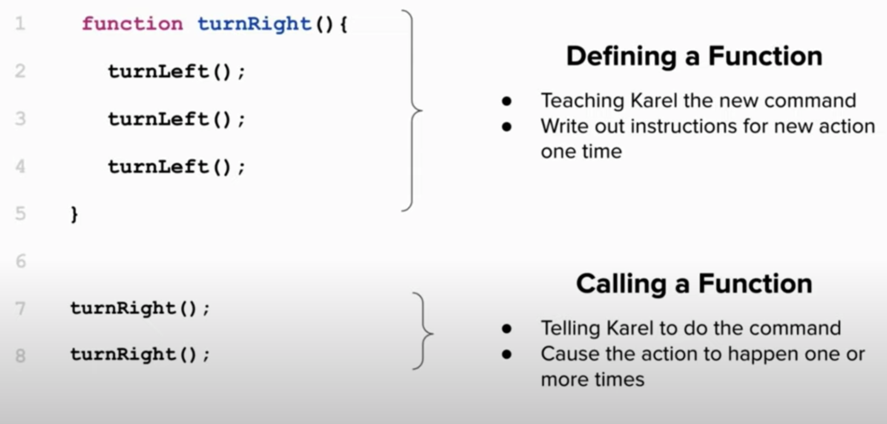

# Functions

Recall these two important ideas that you learned from Karel in CodeHS:





A function is a way to teach Javascript a new command. 

* Breaks programs into smaller parts
* Makes programs easier to understand
* Avoid repeating code over and over

Generally speaking, a function is a "subprogram" that can be called by code external to the function. A function is composed of a sequence of statements called the function body. Values can be passed to a function as parameters, and the function will return a value.

## Example 1

```javascript 
function addHashtag(userString) {
  return "#" + userString
}

function excitedTweet(userString, howManyExclamations) {
  let start = userString.toUpperCase()
  let end = "!".repeat(howManyExclamations)
  return start + end
}

let a = addHashtag("good morning")
let b = excitedTweet("I miss Summer", 3)
let c = excitedTweet("Winter is coming.", 5)
let d = addHashtag("g'night")

console.log(a) 
console.log(b)
console.log(c)
console.log(d) 

```

This program will log the following to the console:
```
#good morning
I MISS SUMMER!!!
WINTER IS COMING.!!!!!
#g'night
```

## Example 2

```javascript 
function isEven(num) {
  if(num%2 == 0){
    return true;
  }else{
    return false;
  }
}

function isPositive(num){
  if(num > 0){
    return true
  }else{
    return false
  }
}

console.log(isEven(5))
console.log(isEven(10))
console.log(isPositive(-5))
console.log(isPositive(0))
console.log(isPositive(5))

```

This program will log the following to the console:
```
false
true
false
false
true
```

## Example 3

```javascript 
function validTweet(tweet){
  if(tweet.length <= 280){
    return true
  }else{
    return false
  }
}

let tweet1 = "people still use twitter??"
let tweet2 = "blah blah blah blah blah blah blah blah blah blah blah blah blah blah blah blah blah blah blah blah blah blah blah blah blah blah blah blah blah blah blah blah blah blah blah blah blah blah blah blah blah blah blah blah blah blah blah blah blah blah blah blah blah blah blah blah blah blah blah blah "

if(validTweet(tweet1)){
  console.log(tweet1)
}
if(validTweet(tweet2)){
  console.log(tweet2)
}

```
This program will log the following to the console:
```
people still use twitter??
```


